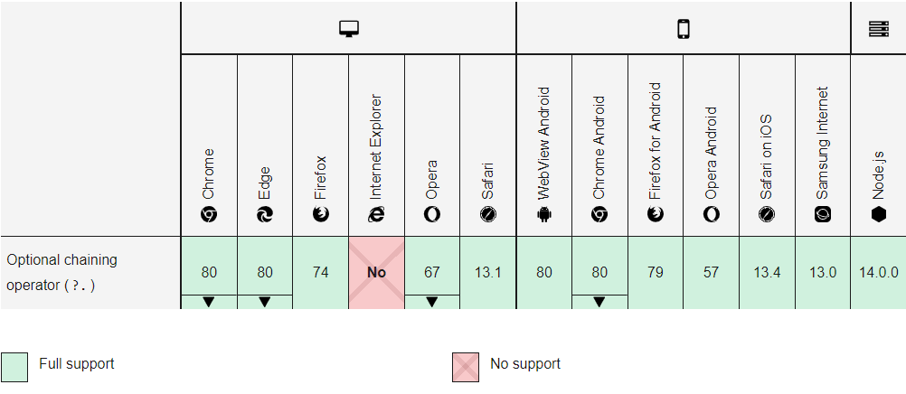

## pdf2img

使用JS将PDF文档转换为图片，并支持下载图片（.zip格式全部下载）

## 示例
[Demo](https://fish-uncle.github.io/pdf2img-doc/#/)

## 操作流程
* 操作步骤(选择文件-->文档上传完成-->导出图片)

## 兼容性
* 浏览器（建议Chrome）

|Chrome  |  Firefox |  Safari |  IE|
|:------:|:------:|:------:|:------:|
  |  |  |  
|latest|latest|latest|10+|　　
 
* PDF JS版本2.8.335浏览器支持-20210719，由于pdfjs版本2.8.335中js引入了可选链操作符【?.，??】等，请访问参考下图查看自己的浏览器是否支持。
  

## 许可证
[MIT](LICENSE.md)

